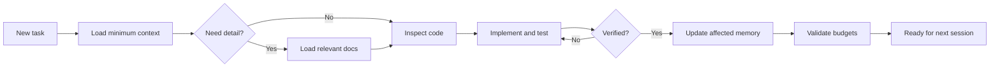

# Project Memory for Codex

A minimal, token-aware project memory system for Codex that preserves verified
context without loading unnecessary history.

> [!IMPORTANT]
> Project Memory for Codex is an independent open-source project. It is not
> affiliated with, endorsed by, or sponsored by OpenAI. "Codex" is used only
> to describe compatibility with the Codex product.

## Why It Is Different

- **Selective context loading:** start with project purpose and current state,
  then load architecture, decisions, or history only when the task requires it.
- **Verified project memory:** treat code and tests as evidence, and repair
  documentation when implementation and memory disagree.
- **Explicit context budgets:** keep always-loaded files small and enforce
  practical size limits with a zero-dependency validator.
- **Version-controlled and reviewable:** store memory beside the code so changes
  can be diffed, reviewed, shared, and reverted through Git.
- **Current truth over session accumulation:** replace stale state instead of
  continuously appending transcripts and completed-task narration.
- **Minimal infrastructure:** no database, vector store, daemon, API key, or
  telemetry is required.

Project Memory for Codex is not designed to remember every conversation. It is
designed to preserve the smallest verified project state needed for reliable
future work.

The toolkit combines:

- a small `AGENTS.md` routing layer,
- focused Markdown documents for current project truth,
- a reusable Codex Skill,
- zero-dependency initialization scripts,
- and a validator that enforces context budgets.

## Agent Benchmark Result

The v0.2 evaluation ran six tasks under three strategies, using 18 fresh,
blinded Agent runs:

| Strategy | Strict task success | Required facts recalled | Estimated context tokens |
|---|---:|---:|---:|
| No memory | 4/6 (66.67%) | 11/14 (78.57%) | 0 |
| Monolithic `AGENTS.md` | 5/6 (83.33%) | 13/14 (92.86%) | 5,352 |
| Selective project memory | 5/6 (83.33%) | 13/14 (92.86%) | 2,921 |

In this benchmark, selective project memory matched the monolithic context's
strict task success and required-fact recall while using **45.42% fewer
estimated project-context tokens**.

Tokens use the transparent approximation `ceil(characters / 4)` because the
runner did not expose provider-measured input usage. Each task/strategy pair
was run once, so these results are evidence for this fixture, not a statistical
significance or universal model-quality claim.

See the [real Agent benchmark report](benchmarks/results/AGENT_BENCHMARK.md),
[complete sanitized evidence](benchmarks/results/agent-evidence.json), and
[deterministic static report](benchmarks/results/REPORT.md).

## Why

Long agent sessions lose focus. Large instruction files create a different
problem: stale context, unnecessary reading, and higher token use.

This project follows a smaller-context rule:

> Keep the always-loaded state minimal, verified, and actionable. Load details
> only when the task requires them.

## Memory Model

| File | Purpose | Default Load |
|---|---|---|
| `AGENTS.md` | Rules and context routing | Always |
| `PROJECT_CONTEXT.md` | Purpose, users, goals, constraints | Always |
| `CURRENT_STATE.md` | Verified progress, blockers, next steps | Always |
| `ARCHITECTURE.md` | Current components, contracts, data flow | Architecture tasks |
| `DECISIONS.md` | Durable choices and trade-offs | When rationale matters |
| `CHANGELOG.md` | Concise historical summary | Historical lookup only |

Git remains the source of truth for exhaustive history.

## Quick Start

Clone this repository, then initialize an existing project.

```bash
git clone --depth 1 https://github.com/Retourflow/project-memory-for-codex.git
```

### macOS And Linux

```bash
bash scripts/init.sh /path/to/project
```

### Windows PowerShell

```powershell
.\scripts\init.ps1 -ProjectPath "C:\path\to\project"
```

Existing files are preserved. Pass `--force` to the Bash script or `-Force` to
PowerShell only when you intentionally want to replace them.

Then replace template statements with facts verified from the codebase:

```bash
python scripts/validate.py /path/to/project
```

## Install The Skill

Copy `skill/codex-project-memory` into a Codex skill directory:

```bash
cp -R skill/codex-project-memory ~/.codex/skills/
```

Invoke it explicitly:

```text
Use $codex-project-memory to initialize and maintain project memory for this repository.
```

The repository-level `AGENTS.md` enforces the workflow for that project. The
Skill provides the reusable method for initializing, updating, and compacting
the memory system.

## Workflow



[Open the editable Product Design workflow in FigJam](https://www.figma.com/board/4WQcVa6a0ZwAiJElFD8KGR).

## Reproduce The Benchmark

Run the zero-dependency static benchmark:

```bash
python benchmarks/run.py
```

It regenerates:

```text
benchmarks/results/latest.json
benchmarks/results/REPORT.md
```

The benchmark includes:

- a realistic layered Python fixture;
- six orientation, architecture, change, resume, and constraint tasks;
- no-memory, monolithic, and selective-memory strategies;
- context characters, words, estimated tokens, loaded files, and fact coverage.

To import measured agent outcomes:

```bash
python benchmarks/run.py \
  --agent-results benchmarks/results/agent-results.json
```

The committed `agent-results.json` contains the 18 real blinded runs. Use
`example-agent-results.json` only as a schema example; its values are
illustrative and are not benchmark claims.

## Context Budgets

The default templates enforce:

| File | Budget |
|---|---:|
| `AGENTS.md` | 150 lines |
| `PROJECT_CONTEXT.md` | 800 words |
| `CURRENT_STATE.md` | 500 words |
| `ARCHITECTURE.md` | 2,000 words |
| `DECISIONS.md` | 4,000 words |
| `CHANGELOG.md` | 4,000 words |

These are guardrails, not targets. Shorter is better when it remains precise.

## Design Principles

- **Verified:** inspect code and tests before updating memory.
- **Token-aware:** read only the documents relevant to the task.
- **Current:** replace stale state instead of endlessly appending.
- **Explicit:** distinguish `Implemented`, `Planned`, `Temporary`, and `Deprecated`.
- **Auditable:** keep context in Git-reviewed text files.
- **Portable:** require no database, API key, daemon, or vector store.

## Validation

Run the test suite:

```bash
python -m unittest discover -s tests -v
```

Test the benchmark fixture:

```bash
PYTHONPATH=benchmarks/fixture-project/src \
  python -m unittest discover -s benchmarks/fixture-project/tests -v
```

Validate the Skill:

```bash
python scripts/validate_skill.py skill/codex-project-memory
```

## Security And Privacy

- The core toolkit does not make network requests, collect telemetry, or require
  credentials.
- Initialization preserves existing files unless replacement is explicitly
  requested with `--force` or `-Force`.
- Project-memory documents must not contain secrets, credentials, tokens,
  personal data, or machine-specific private information.
- Review generated memory before committing it, especially in public
  repositories.

See [SECURITY.md](SECURITY.md) for reporting and safe-use guidance.

## Roadmap

- v0.1: templates, Skill, initialization scripts, and context-budget validation.
- v0.2: reproducible static and blinded Agent benchmarks, evidence, reports,
  result-import schema, and CI.
- v0.3: package the initializer and add guided compaction.

## Contributing

Issues and pull requests are welcome. Keep additions focused on verified context,
low token overhead, and predictable behavior.

## License

MIT
